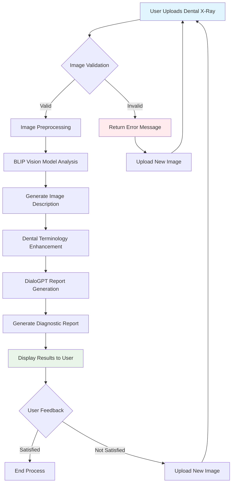

# Dental X-Ray Analysis System Flowchart

This diagram illustrates the complete workflow of the Dental X-Ray Analysis System.

## Process Steps

1. **User Uploads Dental X-Ray**
   - User submits a dental X-ray image through the Gradio interface
   - Supported formats: JPG, PNG, JPEG

2. **Image Validation**
   - System checks if the uploaded file is a valid image
   - Verifies file format and integrity

3. **Image Preprocessing** (If valid)
   - Apply contrast enhancement for dental X-rays
   - Apply sharpening filter to enhance details
   - Normalize image for model processing

4. **BLIP Vision Model Analysis**
   - Salesforce/blip-image-captioning-base model processes the X-ray
   - Generates initial textual description of the image

5. **Generate Image Description**
   - Convert model output into structured text description
   - Extract key features and anomalies from the X-ray

6. **Dental Terminology Enhancement**
   - Add dental-specific terminology to the description
   - Identify common dental conditions based on keywords
   - Structure findings in a standardized format

7. **DialoGPT Report Generation**
   - Microsoft DialoGPT model creates comprehensive diagnostic report
   - Uses dental knowledge base for context
   - Formats report with clinical recommendations

8. **Generate Diagnostic Report**
   - Structure report with sections:
     - Detailed Radiological Findings
     - Differential Diagnoses
     - Clinical Recommendations
     - Follow-up Protocol
     - Prognostic Assessment

9. **Display Results to User**
   - Show enhanced image description
   - Present comprehensive diagnostic report
   - Provide option to upload new image

10. **User Feedback**
    - User evaluates the results
    - Option to upload a new image for analysis
    - Process ends when user is satisfied

## Error Handling

When an invalid image is uploaded:
- System displays error message
- User is prompted to upload a new image
- Process continues with new upload

## Technology Stack

- **Frontend**: Gradio interface for user interaction
- **Image Processing**: OpenCV, PIL, NumPy
- **Vision Model**: BLIP (Salesforce/blip-image-captioning-base)
- **Language Model**: DialoGPT (microsoft/DialoGPT-medium)
- **Dental Knowledge Base**: Specialized dental condition information